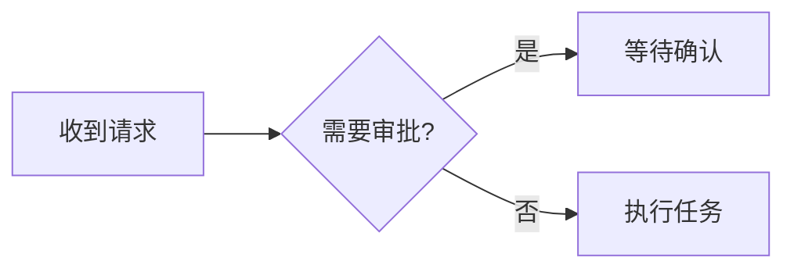

# Markdown 使用说明

对话、历史消息和文件栏的 Markdown 预览使用相同渲染组件。用户消息保留手动换行；普通 Markdown 段落仍遵循 Markdown 的换行规则。

## 代码

使用三个反引号或波浪线包围代码，在开头写上语言名即可启用高亮。语言名不区分大小写。

````markdown
```cpp
#include <iostream>

int main() {
    std::cout << "Hello\n";
}
```
````

支持四空格缩进代码块，以及列表、引用中的代码块。行内代码用单个反引号包围；跨行的行内代码仍按 Markdown 规则显示在段落中。

代码块保留缩进和空行，提供行号、复制、横向滚动及换行开关。复制不包含行号和围栏标记。回复持续生成时立即显示新内容，稍后补充高亮。未指定语言或未知语言按纯文本显示；显式使用 `text` 可展示原始 Markdown、公式和图表语法。

| 类别 | 支持的语言名 |
| --- | --- |
| 命令行 | shellscript、shellsession、powershell、bat |
| 数据与配置 | json、jsonc、json5、yaml、toml、xml、ini、dotenv |
| Web | javascript、typescript、jsx、tsx、vue、svelte、html、css、scss |
| 常用编程语言 | c、cpp、csharp、java、kotlin、go、rust、python、php、ruby、lua、r、swift、objective-c、dart |
| 查询与接口 | sql、graphql、http、proto |
| 构建与部署 | dockerfile、make、cmake、nginx |
| 文档与差异 | markdown、latex、mermaid、diff |

常用别名包括 `js`、`ts`、`py`、`rb`、`C++`、`C#`、`bash`、`sh`、`pwsh`、`ps1`、`batch`、`cmd`、`console`、`yml`、`protobuf`、`tex` 和 `mmd`。

文件源码预览共用这些语法，并识别 `.hpp/.cc/.cxx`、`.psm1/.psd1` 等扩展名，以及 Dockerfile、Makefile、CMakeLists.txt、nginx.conf、`.env`、`.env.example`、`.bashrc`、tsconfig.json 等常见文件名。

## 公式

行内公式使用 `\(a^2 + b^2 = c^2\)`。块公式可使用 `\[ … \]`，或将两个 `$$` 分别放在公式前后的独立行：

```text
$$
\frac{1}{2} + \sum_{n=1}^{3} n
$$
```

公式通过本地 KaTeX 渲染。单个 `$` 不启用公式，因此 `$200/mo`、`$80` 等金额保持原文。行内代码和普通代码块中的公式语法按源码显示。过宽的块公式可以单独横向滚动。

## Mermaid 图表

使用 `mermaid` 或 `mmd` 代码块描述流程图、时序图等 Mermaid 图表：

````markdown

````

点击图表可放大、缩放和拖动，按 Escape 返回。工具栏可切换图表/源码、复制原始代码；源码视图支持行号与换行。语法未完成或有错误时仍显示源码及解析原因，后续回复补全后会重新尝试渲染。图表随浅色/深色主题更新。

## 其他格式

支持一至六级标题、粗体、斜体、双波浪线删除线、嵌套列表、引用、分隔线、表格和脚注。单波浪线保持原文，方便展示 shell 路径和提示符。任务列表显示勾选状态，复选框只读：

```markdown
- [x] 已完成
- [ ] 待处理
```

脚注引用与返回链接在当前消息内跳转，不打开文件或切换会话：

```markdown
正文引用[^note]。

[^note]: 脚注内容。
```

HTTP(S) 链接通过默认浏览器打开，会话与文件链接沿用桌面工作台的跳转。原始 HTML 不执行；远程 Markdown 图片以替代文本显示，附件图片使用应用的附件预览。渲染所需的语法、公式字体和图表组件随安装包提供。
